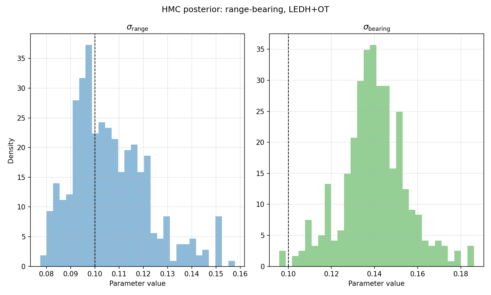

# HMC-DPF-OT

A research implementation of differentiable particle filtering for nonlinear state-space models. The project combines particle-flow proposals with entropy-regularized optimal-transport (OT) resampling, and uses the resulting differentiable likelihood for MAP and Hamiltonian Monte Carlo parameter inference.

## Implemented methods

- **Kalman family:** Kalman filter, extended Kalman filter (EKF), unscented Kalman filter (UKF), and augmented UKF.
- **Particle filters:** bootstrap particle filter and conditional sequential Monte Carlo.
- **Particle-flow filters:** exact Daum–Huang (EDH), localized EDH (LEDH), invertible EDH/LEDH, stochastic EDH, SDE local correction, and kernel-mapping particle flow.
- **Resampling:** systematic, soft, and entropy-regularized OT resampling.

## Differentiable OT resampling

Ordinary resampling selects discrete ancestor indices, so a small parameter change can abruptly change the selected particles and interrupt pathwise gradients. OT resampling instead transports the weighted particle cloud to uniform weights with a continuous Sinkhorn transport plan. The new particles are barycentric projections,

$$
\widehat{X} = T X,
$$

where $T$ depends on both the particle geometry through the transport cost and the likelihood through the particle weights. Gradients can therefore flow through both paths.

**The main difficulty is the OT gradient.** A naive backward pass that treats the converged Sinkhorn potentials as constants and differentiates through only one additional iteration does not capture how the particle-dependent cost influences the entire solve. It can approximate the weight-gradient path, but produces a biased particle-geometry gradient. Fully unrolling every Sinkhorn iteration is also expensive and makes the backward pass depend on the solver history.

**Implicit differentiation is therefore essential.** The custom backward pass in [`ot_entropy.py`](code/src/resampling/ot_entropy.py) applies the implicit function theorem directly to the converged Sinkhorn fixed point. By differentiating its marginal constraints and solving the resulting linear system, it recovers gradients with respect to both the transport cost and particle weights without storing or backpropagating through every iteration.

## Range-bearing example

*HMC marginal posterior histograms for the range and bearing noise scales using LEDH with OT resampling. Dashed lines mark the simulation values.*

The full derivations and experiment details are available in the [project report](report/main_reorganized.pdf).
